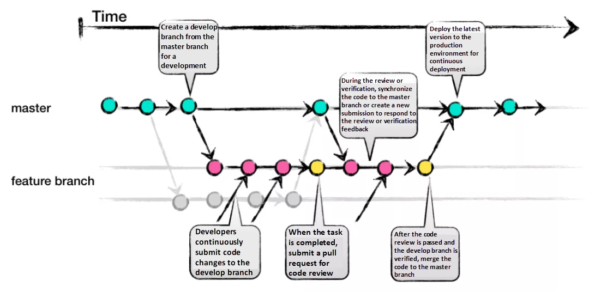

# Git Branch Strategy

## Why
* Engineer know where to branch from and how to merge
* New feature/function work doesn't affect production until ready
* Only tested code reaches master (production)

## GitHub Flow
GitHub Flow is align with what we are doing: simplicity, especially effective for VoIP teams that deploy often and prefer lightweight workflows.

* master branch is source of trust, anything in the master branch is deployable and production server should be deployed from master branch only
* New work should be branch off of master  to work on something new, create a descriptively named branch, example VOIP1234/enable-qos-with-tos. 
* Push to named branches constantly, use the same branch name for local and remote.
* Always create pull request for the new/change
* Merge only after pull request review
* Once it is merged and pushed to master
* This is optional, before deployment, update the CHANGELOG and create a release tag to track the version.

## Reference
* [The best way to use Git and GitHub](https://githubflow.github.io/)
* [Choosing the Right Git Branching Strategy: A Comparative Analysis](https://medium.com/@sreekanth.thummala/choosing-the-right-git-branching-strategy-a-comparative-analysis-f5e635443423)
